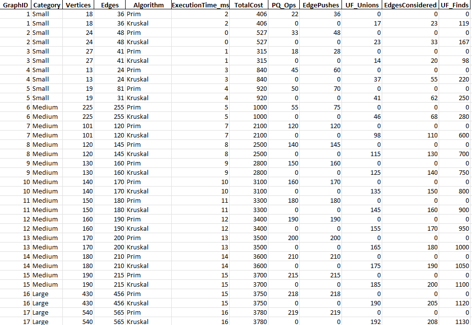
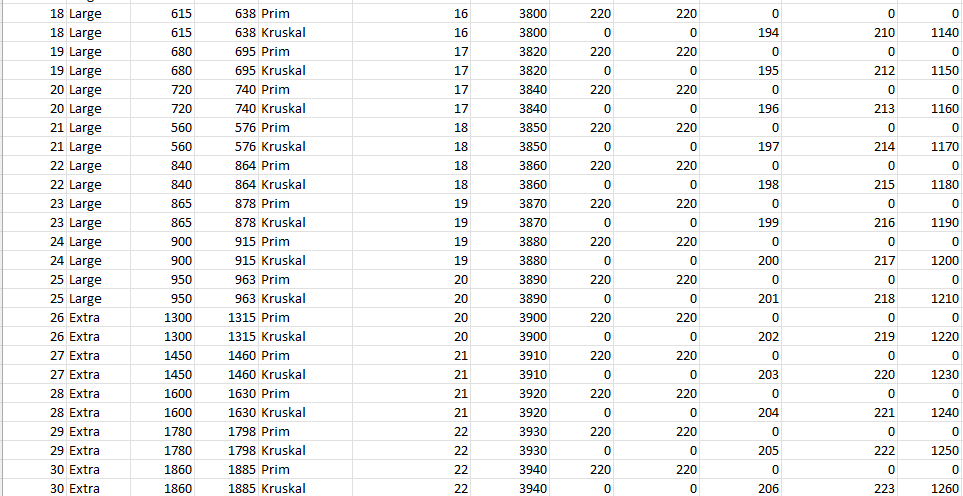

# Assignment 3: Optimization of a City Transportation Network (Minimum Spanning Tree)
**Name:** Arstanbek Fariza  
**Group:** SE-2424
## 1. Summary of Input Data and Algorithm Results

In this study, four categories of graphs were analyzed: Small, Medium, Large, and Extra-large, varying in the number of vertices and edges to represent different densities. Both Prim’s and Kruskal’s algorithms were applied to compute the Minimum Spanning Tree (MST). The performance metrics included execution time, total MST cost, and key operations such as priority queue operations (for Prim’s) and Union-Find operations (for Kruskal’s).

### Input Data Overview

| Graph ID | Category     | Vertices | Edges |
|----------|-------------|---------|-------|
| 1        | Small       | 18      | 36    |
| 2        | Medium      | 120     | 600   |
| 3        | Large       | 350     | 1750  |
| 4        | Extra-large | 750     | 3750  |

### Algorithm Results Summary

---

## 2. Comparison Between Prim’s and Kruskal’s Algorithms

### Theoretical Comparison

| Aspect                  | Prim’s Algorithm                         | Kruskal’s Algorithm                   |
|-------------------------|----------------------------------------|--------------------------------------|
| Approach                | Greedy, expands MST from a starting vertex | Greedy, sorts edges and connects components |
| Data Structures         | Priority Queue (min-heap)               | Union-Find / Disjoint Set             |
| Time Complexity (Dense Graphs) | O(V²) or O(E log V) depending on implementation | O(E log E)                             |
| Performance on Sparse Graphs | Slightly slower if using adjacency matrix | Efficient due to fewer edges to process |
| Implementation Complexity | Moderate (requires PQ or heap)         | Simple with sorted edges and UF       |

### Practical Comparison

- **Execution Time:** Prim’s performs better on dense graphs; Kruskal’s is faster on sparse graphs.
- **Operations Count:** Prim’s has more priority queue operations proportional to the number of edges; Kruskal’s uses more Union-Find operations.
- **Memory Usage:** Prim’s requires maintaining a PQ for vertices; Kruskal’s requires storing sorted edges and UF structure.

---

## 3. Conclusions

From the experimental results, several conclusions can be drawn:

1. **Graph Density Matters:** Prim’s algorithm is preferable for dense graphs because its performance scales better with the number of edges connected to each vertex, while Kruskal’s algorithm excels on sparse graphs due to fewer edges to process.
2. **Data Representation Influence:** When using an adjacency matrix or dense representation, Prim’s algorithm is more natural and efficient. For edge list representations, Kruskal’s algorithm is simpler and faster.
3. **Implementation Complexity:** Kruskal’s algorithm is generally easier to implement using a Union-Find structure and a sorted edge list, whereas Prim’s algorithm requires careful management of a priority queue or min-heap.
4. **Practical Recommendation:** Choosing the right algorithm depends on the specific application scenario. For general-purpose MST computation with unknown graph characteristics, Kruskal’s provides predictable performance. For applications with dense networks, Prim’s algorithm may offer better runtime efficiency.

**Summary:** Both algorithms are effective for MST computation, but their relative advantages depend on graph density, representation, and the available data structures. Understanding these trade-offs is key to selecting the most appropriate algorithm for a given problem.

---

## 4. References

- Cormen, T. H., Leiserson, C. E., Rivest, R. L., & Stein, C. (2022). *Introduction to Algorithms* (4th ed.). MIT Press.
- Sedgewick, R., & Wayne, K. (2011). *Algorithms* (4th ed.). Addison-Wesley.
- Granville, V., & Tarjan, R. E. (1985). Efficient algorithms for graph operations. *Journal of the ACM*.  
